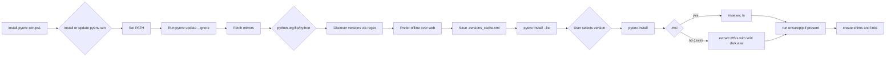

## Diagram - update flow (flowchart LR)

```mermaid
flowchart LR
    A[install-pyenv-win.ps1] --> B{Install or update pyenv-win}
    B --> C[Set PATH]
    C --> D[Run pyenv update --ignore]
    D --> E[Fetch mirrors]
    E --> F{python.org/ftp/python}
    F --> G[Discover versions via regex]
    G --> H[Prefer offline over web]
    H --> I[Save .versions_cache.xml]
    I --> J[pyenv install --list]
    J --> K{User selects version}
    K --> L[pyenv install <version>]
    L --> M{.msi}
    M -- yes --> N[msiexec /a]
    M -- no (.exe) --> O[extract MSIs with WiX dark.exe]
    N --> P[run ensurepip if present]
    O --> P
    P --> Q[create shims and links]
```
